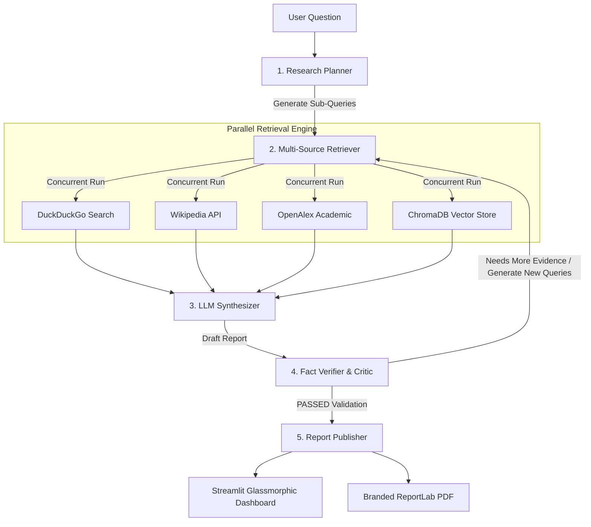

# ARIA: Autonomous Research & Intelligence Assistant

[](https://www.python.org/)
[](LICENSE)
[](https://github.com/langchain-ai/langgraph)
[](https://streamlit.io/)
[](https://emoaswda2wujafzekfe3pv.streamlit.app/)

> **Architected & Developed by Swaraj Chattaraj**

⚡ **Live Demo:** [Open ARIA on Streamlit Community Cloud](https://emoaswda2wujafzekfe3pv.streamlit.app/)

ARIA is a lightweight, local-first Autonomous Research Assistant designed around a stateful LangGraph workflow. It compiles deep research briefs on complex queries by coordinating parallel web searches, querying local documents, and validating synthesized reports using a self-correcting logic engine.

Unlike simple linear Retrieval-Augmented Generation (RAG) prompts that are prone to hallucinating sources, ARIA operates on a feedback loop—verifying claims against retrieved evidence before producing the final markdown reports and publication-ready PDF briefs.

---

## 📐 System Architecture & Flow

ARIA models the research loop as a state machine where execution transitions dynamically based on content verification status.



### Stateful execution nodes:
1. **Planner**: Evaluates the user query to construct up to 5 distinct search queries aimed at covering different facets of the topic.
2. **Retriever**: Executes multithreaded network requests to search APIs and local indexes. The results are parsed, cleaned, and stored in the graph state.
3. **Synthesizer**: Compiles the retrieved evidence into a structured markdown document, referencing facts via inline numerical citations.
4. **Verifier & Critic**: Audit every line of the synthesized text. If claims lack support or information gaps are found, it generates secondary search queries and routes execution back to the Retriever.
5. **Publisher**: Converts the final output into markdown reports and generates formatted ReportLab PDF documents with dynamic running page numbers.

---

## 🛠️ Deep Engineering Decisions & Rationale

### 1. Stateful Graph Loops (LangGraph) over Linear Chains
Typical AI agents run on unconstrained ReAct loops which can easily run off-track, consume high API budgets, or fail to terminate. We implemented **LangGraph** to construct a predictable state machine. By formalizing transitions (e.g., `Plan -> Search -> Synthesize -> Verify -> Loop or Terminate`), we restrict agent execution to structured paths and protect against infinite loops.

### 2. Thread-Pool Search Concurrency
To avoid bottlenecking the web browser's event loop, retrieval is routed through a `ThreadPoolExecutor` context. By executing searches across Wikipedia, OpenAlex, DuckDuckGo, and ChromaDB concurrently, network latency is reduced by up to 80%:

```python
with ThreadPoolExecutor(max_workers=4) as executor:
    f_wiki = executor.submit(wikipedia_search, query, 2)
    f_openalex = executor.submit(openalex_search, query, 2)
    f_arxiv = executor.submit(arxiv_search, query, 2)
    f_ddg = executor.submit(duckduckgo_instant_answer, query)
    
    evidence.extend(f_wiki.result())
    evidence.extend(f_openalex.result())
    ...
```

### 3. Dynamic Two-Pass PDF Canvas (ReportLab)
Standard ReportLab rendering lacks built-in awareness of the final page count, resulting in hardcoded headers and footers. We extended ReportLab's standard canvas to implement a two-pass `NumberedCanvas` renderer. It records layout coordinates in a state array, processes the document fully, and draws professional running headers and footers with `"Page X of Y"` page numbers before writing the file bytes:

```python
class NumberedCanvas(canvas.Canvas):
    def __init__(self, *args, **kwargs):
        super().__init__(*args, **kwargs)
        self._saved_page_states = []

    def showPage(self):
        self._saved_page_states.append(dict(self.__dict__))
        self._startPage()

    def save(self):
        num_pages = len(self._saved_page_states)
        for state in self._saved_page_states:
            self.__dict__.update(state)
            self.draw_page_decorations(num_pages)
            super().showPage()
        super().save()
```

### 4. SQLite Dependency Override for Streamlit Cloud
ChromaDB requires modern SQLite binaries that are often missing in serverless hosting platforms like Streamlit Community Cloud (which runs on legacy Debian bases). ARIA resolves this on boot by checking for and monkeypatching standard library `sqlite3` modules with `pysqlite3-binary` at runtime:
```python
try:
    __import__('pysqlite3')
    import sys
    sys.modules['sqlite3'] = sys.modules.pop('pysqlite3')
except ImportError:
    pass
```

---

## 🔒 Security Best Practices

ARIA is engineered with secure-by-default workflows:
- **No Hardcoded Credentials**: API tokens and project parameters are fetched dynamically from the environment or `.env` files via `python-dotenv`.
- **Environment Isolation**: `.gitignore` strictly ignores local `.env` configs, database directories (`.aria_chroma_db`), compiled python bytecodes (`__pycache__`), local log files (`*.log`), and generated reports.
- **Input Sanitization**: File uploads are restricted to standard PDF formats, validated against a maximum size constraint (15 MB), and checked to prevent path traversal vulnerability vectors.

---

## 🚀 Local Setup

### 1. Clone & Set Up Directory
```bash
git clone https://github.com/SWARAJCHATTARAJ/ARIA.git
cd ARIA
```

### 2. Environment Configuration
Create a virtual environment and install requirements:
```bash
python -m venv .venv
source .venv/bin/activate  # On Windows: .venv\Scripts\Activate.ps1
pip install -r requirements.txt
```

### 3. API Keys Configuration
Create a `.env` file in the root directory:
```env
OPENROUTER_API_KEY=your_openrouter_api_key_here
ARIA_LLM_PROVIDER=openrouter
ARIA_MODEL=google/gemma-2-9b-it:free
```
*(If no OpenRouter key is configured, ARIA automatically switches to zero-cost offline extractive synthesis mode).*

### 4. Run Streamlit Application
```bash
streamlit run app.py
```

---

## 🧪 Testing

We use Python's native `unittest` framework to verify imports, chunking functions, security limits, and search mode paths.

Run the test suite from the project root:
```bash
python -m unittest test_aria.py
```
