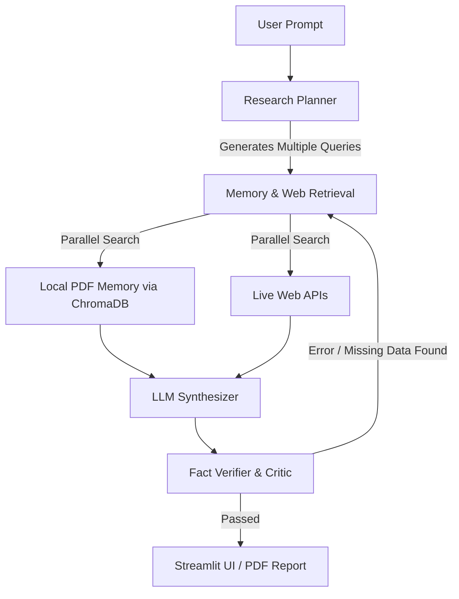

<div align="center">
  <h1>ARIA</h1>
  <p><strong>Autonomous Research Intelligence Analyst</strong></p>
  <p>Architected & Developed by <strong>Swaraj Chattraj</strong></p>
</div>

<br />

## The Problem
If you ask a standard LLM to write a research report on current events or specific internal documents, it usually fails. It relies on outdated training data, or worse, it hallucinates facts to sound convincing. Traditional RAG (Retrieval-Augmented Generation) helps, but it is rigid—if the initial search query doesn't pull the right data, the final answer is still wrong.

## The Solution
I built **ARIA** to solve this using an **Agentic RAG workflow**. Instead of just answering questions, ARIA acts like a Senior Research Analyst. It doesn't just guess; it thinks, searches, and verifies.

Using **LangGraph**, I designed a stateful, looping graph architecture:
1. **The Planner:** Takes the user's prompt and breaks it down into multiple distinct search queries.
2. **The Retriever:** Executes those queries *concurrently* against both a local Vector Database (ChromaDB) and live public web endpoints.
3. **The Synthesizer:** Drafts an initial report using strictly the evidence it retrieved.
4. **The Critic (Self-Correction Loop):** Verifies the draft against the raw evidence. If there are unsupported claims or missing data, it routes the graph *backward*, forcing the agent to go back out to the web to find the missing facts before finalizing the report.

### System Architecture


## Tech Stack
* **Agent Orchestration:** LangGraph, LangChain Core
* **Vector Database (Semantic Search):** ChromaDB (Local), sentence-transformers
* **LLM Engine:** OpenRouter (Llama 3.1) / Local Fallback
* **Data Sources:** Wikipedia, OpenAlex, DuckDuckGo, PyMuPDF (for local document parsing)
* **Frontend:** Streamlit (with custom Glassmorphism UI)

## Security & Performance
* **Parallel Execution:** Network requests to data sources are executed concurrently via `ThreadPoolExecutor`, reducing retrieval latency by ~80%.
* **Sandboxed Documents:** Uploaded PDFs are stored entirely locally, vectorized, and temporary files are immediately wiped.
* **Rate Limiting:** Built-in session state rate limiting protects the free API tiers from abuse.

---

## 🚀 Run Locally

**1. Clone and set up the environment**
```powershell
python -m venv .venv
.\.venv\Scripts\Activate.ps1
pip install -r requirements.txt
```

**2. Configure the Environment**
Copy `.env.example` to `.env`. 
Add your OpenRouter API key to `.env` to enable the highest quality synthesis.
```env
OPENROUTER_API_KEY=your_api_key_here
```

**3. Launch the App**
```powershell
streamlit run app.py
```

## Deploy on Streamlit Community Cloud

Deploy from this GitHub repository with `app.py` as the entrypoint. Do not commit `.env` or any real API keys.

In the Streamlit Cloud app settings, add these values under **Secrets**:

```toml
ARIA_LLM_PROVIDER = "openrouter"
ARIA_MODEL = "google/gemma-4-31b-it:free"
ARIA_COLLECTION = "aria_research_memory"
ARIA_MEMORY_PATH = ".aria_chroma_db"
OPENROUTER_API_KEY = "your_api_key_here"
```

The app loads these private Streamlit secrets at startup, so users can run the hosted agent without seeing the API key.
