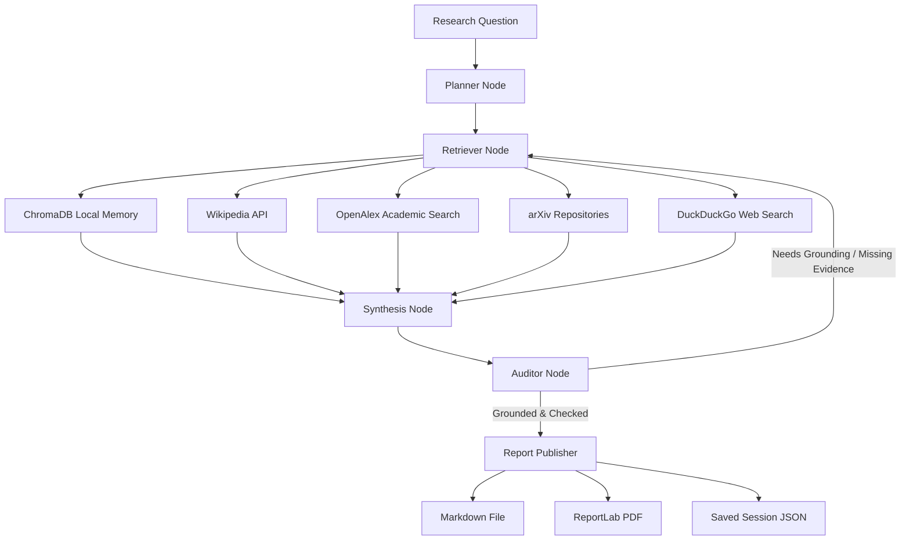

# ARIA — Autonomous Research & Intelligence Assistant

[](https://www.python.org/)
[](https://github.com/langchain-ai/langgraph)
[](https://react.dev/)
[](https://fastapi.tiangolo.com/)
[](LICENSE)

ARIA is a local-first research workspace that helps you answer complex questions with evidence. It plans research tasks, gathers data from multiple local and web sources in parallel, drafts structured reports with inline citations, verifies claims to prevent hallucinations, and outputs clean Markdown and ReportLab PDFs.

Built by **Swaraj Chattaraj** as a hands-on exploration of what real-world, production-ready RAG looks like when you move past simple chat boxes.

* [Live Streamlit App](https://emoaswda2wujafzekfe3pv.streamlit.app/)
* [GitHub Repository](https://github.com/SWARAJCHATTARAJ/ARIA)

---

## Why ARIA?

Most Retrieval-Augmented Generation (RAG) tools are single-turn: you ask a question, the system does a single vector search, merges the top snippets, and outputs an answer. If the retrieval missed the mark, or if the model hallucinated, the response is flawed.

ARIA is designed to act more like a research assistant. When you give it a topic, it:
1. **Deconstructs** your prompt into multiple search queries.
2. **Scrapes** both your local files and live public APIs concurrently.
3. **Drafts** a structured report with interactive, clickable inline citations.
4. **Audits** itself by checking if every assertion is actually backed by the retrieved evidence.
5. **Self-corrects** by querying for more information if the initial report lacks grounding.
6. **Persists** the session locally so you can pause, resume, or view past research.

The goal wasn't to wrap an LLM in a pretty interface; it was to build a reliable research loop with structured planning, parallel web retrieval, validation, and session persistence.

---

## What ARIA Can Do

- **Stateful Research Loop:** Built using LangGraph, keeping track of findings, search steps, and audit logs.
- **Concurrent Web Gathering:** Uses `asyncio` and `aiohttp` to search Wikipedia, arXiv, OpenAlex, DuckDuckGo, and financial snapshots at the same time, dropping query latency from ~11s down to ~4s.
- **Strict Verification (Self-Correction):** An Auditor node verifies the generated text against raw sources, sending the agent back to search for more evidence if the draft makes ungrounded claims.
- **Local-First Storage:** Keeps your uploaded files, vector database (ChromaDB), and research sessions (`.aria_sessions/`) on your own machine.
- **Cross-Platform Deployments:** 
  - **Web Console:** A React + Tailwind CSS dashboard.
  - **Desktop Client:** A standalone Windows window using PyWebView.
  - **Mobile PWA/TWA:** Fully responsive layout with Android Trusted Web Activity support for home-screen installation.
- **Professional Exports:** Exports research sessions as clean Markdown or custom ReportLab PDFs featuring evidence summaries and pagination.

---

## Architecture & Data Flow



### The 5-Stage Research Lifecycle
1. **Plan:** Decompose the research prompt into independent, targeted queries.
2. **Retrieve:** Search local documents and query public web endpoints in parallel.
3. **Synthesize:** Write a detailed brief. If no external LLM key is configured, ARIA uses a local extractive synthesis engine as a fallback.
4. **Audit:** Verify every claim against source documents to prevent hallucinated assertions.
5. **Publish & Persist:** Write reports, format a PDF brief, and store the session locally.

---

## Tech Stack

| Layer | Technology |
| --- | --- |
| **Language & Core** | Python 3.9+ |
| **Agent Engine** | LangGraph & LangChain Core |
| **Storage & Memory** | ChromaDB (Vector Index) & Local JSON (Sessions) |
| **API Backend** | FastAPI & Uvicorn |
| **Web UI** | React, Vite, and Tailwind CSS |
| **Async Tasks** | `asyncio` & `aiohttp` for parallel HTTP calls |
| **Document Processing** | PyMuPDF (PDF reading) & ReportLab (PDF writing) |
| **Wrappers** | Streamlit (deployment utility), PyWebView (Desktop), Gradle/TWA (Android) |

---

## Running Locally

### Prerequisites
Make sure you have **Python 3.9+** and **Node.js** installed on your system.

### 1. Clone the Repository
```bash
git clone https://github.com/SWARAJCHATTARAJ/ARIA.git
cd ARIA
```

### 2. Set Up the Python Backend
Create a virtual environment, activate it, and install the dependencies:
```bash
python -m venv .venv

# On Windows:
.venv\Scripts\activate

# On macOS/Linux:
source .venv/bin/activate

pip install -r requirements.txt
```

### 3. Configure Environment Variables
Create a `.env` file in the root directory. You can use `.env.example` as a starting template:
```env
# Optional: Provide an API key to enable LLM-powered planning and verification
OPENROUTER_API_KEY=your_openrouter_api_key_here
ARIA_LLM_PROVIDER=openrouter
ARIA_MODEL=google/gemma-2-9b-it:free
```
*Note: If no LLM key is supplied, ARIA runs in a local-only extractive synthesis mode.*

### 4. Run the Application
Start the Streamlit wrapper, which automatically checks for built frontend files and launches the FastAPI backend:
```bash
streamlit run app.py
```
Open **`http://localhost:8501/`** in your web browser.

---

## Other Run Modes

### Desktop App (Windows GUI)
If you want to run ARIA as a standalone desktop window, install the optional dependencies and run the launcher:
```bash
pip install -e .[desktop]
python desktop_app.py
```
This initializes the backend and opens a desktop GUI frame (powered by `pywebview`), bypassing the browser.

### Android Application
The `app/` directory contains an Android Gradle configuration for packaging ARIA as a Trusted Web Activity (TWA).
1. Configure your production app URL in `twa-manifest.json`.
2. Open the project root in Android Studio or run Gradle commands to compile:
   ```bash
   ./gradlew assembleRelease
   ```
This generates a signed WebAPK for mobile installations.

---

## Development & Testing

Run the test suite using Python's built-in unit tests to confirm retrieval logic and document parsers are working:
```bash
python -m unittest test_aria.py
```

---

## Engineering Notes & Insights

Building ARIA provided several practical takeaways regarding agentic system engineering:
- **Workflows over Autonomy:** Open-ended agents easily veer off track. Constraining agent states inside a LangGraph state machine provides predictable state transitions while keeping retrieval flexible.
- **Validator Boundaries:** Self-correcting loops can loop infinitely if the validation criteria are too strict or if the required data doesn't exist. Setting a hard `max_iterations` ceiling is essential for stability.
- **Concurrent Retrieval:** Synchronous network fetching is a huge bottleneck for multi-source search. Switching to parallelized requests with `asyncio` cut search latencies from roughly 11 seconds to 4 seconds.
- **Environment Hurdles:** Deploying SQLite/ChromaDB on managed Streamlit environments requires specific database configurations. ARIA uses a local `pysqlite3` import override fallback to ensure compatibility on systems running older SQLite versions.

---

## License

This project is licensed under the MIT License. See [LICENSE](LICENSE) for details.

## Contact & Credits

Designed and built by **Swaraj Chattaraj**.
- **Email:** swarajchattaraj17402@gmail.com
- **GitHub:** [@SWARAJCHATTARAJ](https://github.com/SWARAJCHATTARAJ)
