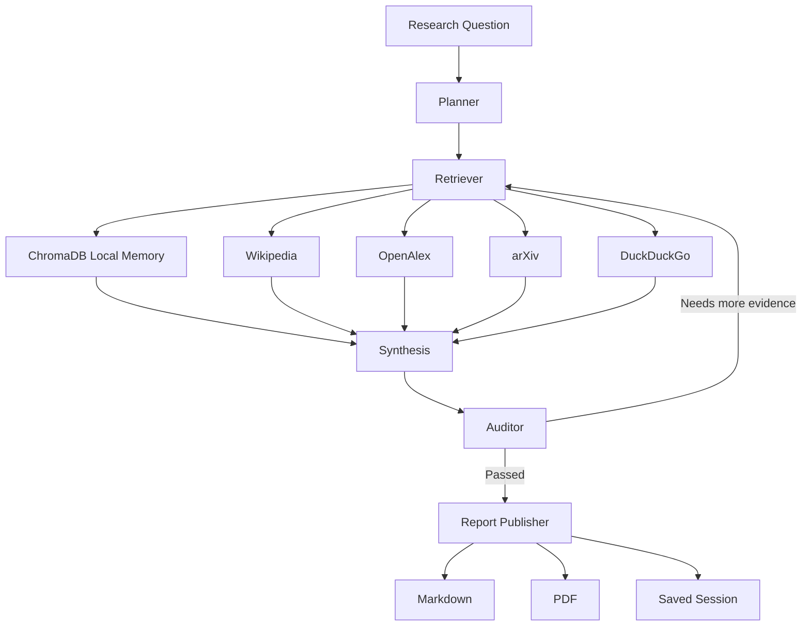

# ARIA - Autonomous Research & Intelligence Assistant

[](https://www.python.org/)
[](https://github.com/langchain-ai/langgraph)
[](https://react.dev/)
[](https://fastapi.tiangolo.com/)
[](LICENSE)

**ARIA is a local-first AI research workspace that plans a question, retrieves evidence, writes a cited brief, verifies the draft, and exports a polished PDF.**

Built by **Swaraj Chattaraj** to explore what production-style agentic RAG looks like beyond a simple chatbot.

[Repository](https://github.com/SWARAJCHATTARAJ/ARIA)

---

## Why This Exists

Most RAG demos answer once and hope the sources are enough.

ARIA behaves more like a research analyst:

- breaks a broad question into focused search queries
- searches local documents and public web sources
- writes a structured answer with inline citations
- checks whether the answer is grounded in retrieved evidence
- saves sessions so research can be resumed later
- exports Markdown and ReportLab PDF briefs

The goal was not just to build a UI around an LLM. The goal was to build a small but realistic research loop with planning, retrieval, verification, provenance, and persistence.

---

## Product Preview

| Preview | Link |
| --- | --- |
| Live dashboard | [Open ARIA on Streamlit](https://emoaswda2wujafzekfe3pv.streamlit.app/) |
| Source code | [View GitHub repository](https://github.com/SWARAJCHATTARAJ/ARIA) |
| Dashboard screenshot | Coming soon: `docs/assets/dashboard.png` |
| Evidence register screenshot | Coming soon: `docs/assets/evidence-register.png` |
| Workflow GIF | Coming soon: `docs/assets/workflow.gif` |
| Sample PDF report | Coming soon: `docs/assets/sample-report.pdf` |

---

## What ARIA Can Do

- **Agentic research loop:** planner, retriever, synthesis, and validator components inside a LangGraph workflow.
- **Clickable citations:** inline `[1]` citations become source links when URLs are available.
- **Evidence provenance:** each source tracks type, score, retrieval path, URL, and source id.
- **Hybrid retrieval:** ChromaDB local memory plus Wikipedia, OpenAlex, arXiv, DuckDuckGo, and optional market snapshots.
- **Session persistence:** completed research runs are saved locally and can be resumed from the History view.
- **Async web retrieval:** public source calls use `asyncio` + `aiohttp`, with a synchronous fallback path.
- **Export pipeline:** Markdown and professionally formatted PDF reports with page numbers and evidence tables.

---

## Benchmarks

Local checks on this repository, measured on a Windows laptop virtualenv:

| Operation | Result |
| --- | ---: |
| Local-only agent run over one indexed note | ~0.63s |
| Markdown report generation | ~0.01ms/report |
| PDF generation with 8 evidence sources | ~15.8ms/report |
| Test suite | 11 tests passing |

Earlier retrieval experiments showed that concurrent public-source retrieval is much faster than sequential API calls for I/O-bound search. In practice, parallel retrieval reduced multi-source search latency from roughly **~11s sequential** to **~4s concurrent** on typical web queries. Exact timings vary by network and API response time.

---

## Architecture



### Core workflow

1. **Plan:** turn the user question into focused search queries.
2. **Retrieve:** collect evidence from local memory and public sources.
3. **Synthesize:** draft a grounded research brief.
4. **Verify:** check whether claims are supported by evidence.
5. **Persist:** save the final run, evidence, metrics, and report outputs.

---

## Tech Stack

- **Python** for the agent and retrieval code
- **React + Tailwind CSS** for the research console UI
- **FastAPI** for serving the app and API endpoints
- **LangGraph** for stateful agent orchestration
- **ChromaDB** for local vector memory
- **aiohttp / asyncio** for async public-source retrieval
- **ReportLab** for PDF generation
- **PyMuPDF** for PDF ingestion
- **OpenRouter optional** for LLM-backed planning, drafting, and verification

If no OpenRouter key is configured, ARIA falls back to a local extractive synthesis mode.

---

## Run Locally

```bash
git clone https://github.com/SWARAJCHATTARAJ/ARIA.git
cd ARIA

# Set up virtual environment
python -m venv .venv
.venv\Scripts\activate
pip install -r requirements.txt

# Start the Streamlit wrapper for the React console
streamlit run app.py
```

Open `http://localhost:8501/` in your browser to access the ARIA Research Console. Streamlit will display the React console from `frontend/` and start the local FastAPI backend when needed.

Optional `.env`:

```env
OPENROUTER_API_KEY=your_openrouter_api_key_here
ARIA_LLM_PROVIDER=openrouter
ARIA_MODEL=google/gemma-2-9b-it:free
```

If you deploy the Streamlit app on a public host, it cannot connect to a backend running on `127.0.0.1` in the browser. In that case, deploy the FastAPI app separately and set:

```env
ARIA_BACKEND_URL=https://your-fastapi-host.example.com
```

---

## Test

```bash
python -m unittest test_aria.py
```

Current local result:

```text
Ran 11 tests
OK
```

---

## Security And Local-First Defaults

- No hardcoded credentials
- `.env` and Streamlit secrets are ignored by git
- PDF uploads are validated by file type, size, and safe path handling
- ChromaDB memory stays local under `.aria_chroma_db/`
- Saved research sessions stay local under `.aria_sessions/`

---

## What I Learned

Building ARIA helped me understand the real engineering problems behind agentic RAG:

- stateful workflows are easier to control than open-ended agent loops
- verification needs hard iteration limits to avoid runaway retries
- citations are only useful when they link back to source evidence
- persistence turns a demo into something that feels like a real workspace
- deployment details matter, especially ChromaDB's SQLite requirement on Streamlit Cloud

ARIA is intentionally lightweight, but it now includes the pieces that make an AI research tool credible: retrieval, grounding, provenance, exports, observability, and resumable sessions.
