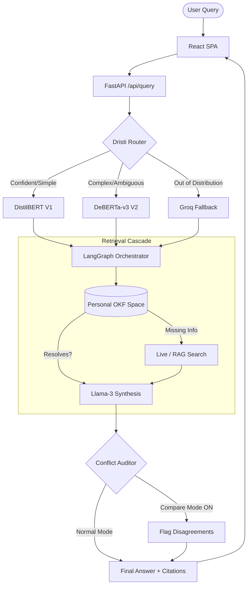

# ARIA v2 (Autonomous Research & Intelligence Assistant)

Hey there! 👋 Welcome to **ARIA v2**. 

ARIA isn't just another ChatGPT wrapper. I built this from the ground up as a rigorous, researcher-grade workspace designed to verify facts, instantly cite specific sources, and build transparent literature reviews without the typical AI hallucinations. 

If you are a researcher, academic, or just someone who hates "trust me bro" AI answers, ARIA is built for you. It strictly separates what it knows natively (via external live search) from what *you* know (via your Personal OKF Space), and will explicitly flag factual conflicts between the two.

---

## 🏗 Architecture

ARIA is structured as a modern decoupled monorepo:
- **Frontend**: A lightning-fast React + Vite SPA, styled with Tailwind CSS to look like a dense, high-information Bloomberg terminal. It deploys perfectly to Vercel and is fully PWA-ready (so you can install it as a Trusted Web Activity on Android).
- **Backend**: A heavily asynchronous Python FastAPI server running LangGraph. It runs natively on a Linux Azure VM behind a Caddy reverse-proxy. 
- **The Brain (Dristi)**: Routing is offloaded to a local Dristi inference engine (DistilBERT/DeBERTa-v3) which dynamically routes queries based on complexity and confidence.

Here's exactly how a query flows through the system:


```mermaid
flowchart TD
    User([User Query]) --> Frontend[React SPA]
    Frontend --> API[FastAPI /api/query]
    
    API --> Router{Dristi Router}
    Router -- Confident/Simple --> V1[DistilBERT V1]
    Router -- Complex/Ambiguous --> V2[DeBERTa-v3 V2]
    Router -- Out of Distribution --> LLM_Fallback[Groq Fallback]
    
    V1 --> Cascade
    V2 --> Cascade
    LLM_Fallback --> Cascade
    
    subgraph Retrieval Cascade
    Cascade[LangGraph Orchestrator] --> OKF[(Personal OKF Space)]
    OKF -- Resolves? --> Synthesize
    OKF -- Missing Info --> LIVE[Live / RAG Search]
    LIVE --> Synthesize
    end
    
    Synthesize[Llama-3 Synthesis] --> Audit{Conflict Auditor}
    
    Audit -- Compare Mode ON --> Detect[Flag Disagreements]
    Audit -- Normal Mode --> Output[Final Answer + Citations]
    Detect --> Output
    
    Output --> Frontend
```

---

## ✨ Key Features

### 1. The Retrieval Cascade (Trust before Speed)
ARIA doesn't just throw your prompt into an LLM. It relies on a strictly hierarchical retrieval cascade:
1. **OKF (Object Knowledge Format)**: ARIA searches your personal, verified flat-file notes *first*. If it finds the answer there, it stops. 
2. **Live Search**: If your personal space doesn't have the answer, it falls back to live web/RAG retrieval.

### 2. Compare Mode & Conflict Auditing
Ever wonder if the web agrees with your notes? Toggle **Compare Tiers [On]** in the UI. ARIA will deliberately force both the OKF and LIVE pipelines to run simultaneously. A secondary LLM auditor will then explicitly compare the retrieved chunks and flag any factual contradictions right in the chat. Honesty over false confidence!

### 3. Researcher-Grade Micro-Interactions
- **The Confidence Dial**: No fake percentages. ARIA gives you an analog sweeping gauge that snaps into a "High/Medium/Low" confidence band based on where the pipeline resolved.
- **Export to .BIB / .RIS**: Stop manually formatting citations. One click under any AI response generates Zotero/Mendeley compatible plain-text citations.
- **Quick Capture**: Highlight any text in the chat, and a floating toolbar instantly lets you save it directly to your Personal OKF Workspace.
- **Focus Mode**: Press "Focus" to collapse the sidebars and read dense technical answers without distraction.

---

## 🚀 Getting Started

### Local Development (Frontend)
```bash
cd frontend
npm install
npm run dev
```
Make sure you create an `.env` file pointing to your backend IP:
`VITE_API_URL=http://<YOUR_BACKEND_IP>`

### Production Deployment (Backend)
The backend is designed for an Ubuntu Azure VM. 
1. Copy the code to your server.
2. Run the automated deployment script:
```bash
bash infra/setup_vm.sh
```
3. Move the Caddyfile and systemd services into place and start them:
```bash
sudo cp infra/Caddyfile /etc/caddy/Caddyfile
sudo cp infra/*.service /etc/systemd/system/
sudo systemctl daemon-reload
sudo systemctl enable --now caddy aria-backend dristi
```

---

*Built with ❤️ and an unhealthy amount of caffeine.*
